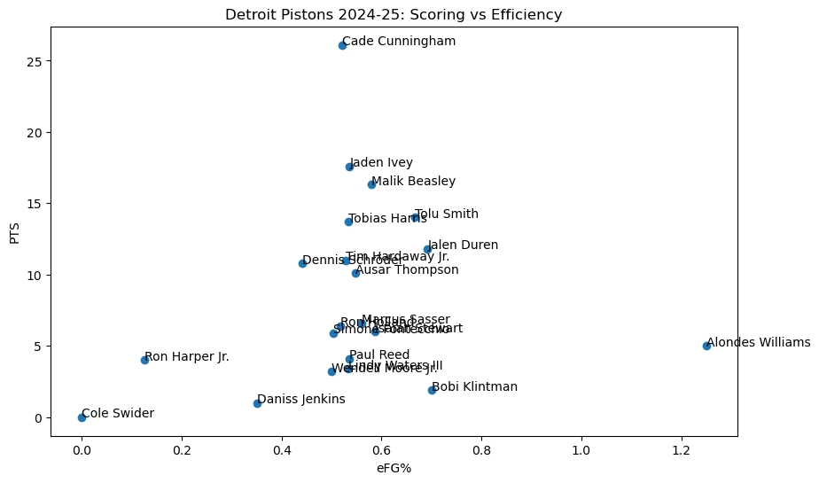

# Detroit Pistons 2024-25赛季数据分析

活塞队2024-25赛季球员表现数据分析项目，重点关注得分效率。

## 项目简介

本项目分析活塞队球员数据，包括：
- 使用eFG%（有效投篮命中率）评估得分效率
- 分析得分量与投篮效率的关系
- 识别高价值球员

## 使用工具

- Python 3.x
- pandas（数据处理）
- matplotlib（数据可视化）
- Jupyter Notebook

## 主要发现

1. Cade Cunningham得分最高（26.1分），但效率中等（eFG% 0.469）
2. Jalen Duren效率最高（eFG% 0.692），但出手少（11.8分）
3. 球队整体效率偏低，大部分球员eFG%低于0.6

## 数据来源

- 数据：[Basketball Reference](https://www.basketball-reference.com/teams/DET/2025.html)
- 时间：2024-25赛季常规赛
- 球员数量：21人

## 文件说明

- `pistons_analysis.ipynb` - 主分析文件，包含完整代码和分析过程
- `pistons.csv` - 原始数据
- `chart.png` - 散点图：得分vs效率 

## 扩展分析

### 横向对比：活塞 vs 联盟平均

通过6项关键指标对比，发现活塞队的核心特征：

1. **单打型球队** - 助攻少+命中率持平，球队不靠传导球得分
2. **年轻队伍特征** - 篮板多+失误多，身体出色但决策不成熟
3. **靠出手量得分** - 得分高于联盟，但效率偏低

### 纵向对比：本赛季 vs 上赛季

核心球员全部进步：

| 球员 | PTS变化 | eFG%变化 |
|------|---------|----------|
| Cade Cunningham | +3.4 | +0.021 |
| Jaden Ivey | +2.2 | +0.044 |
| Ausar Thompson | +1.3 | +0.042 |
| Jalen Duren | -2.0 | +0.073 |

**Duren现象：** 得分下降但效率大幅提升，印证了球队"围绕Cade构建进攻"的战术调整。
